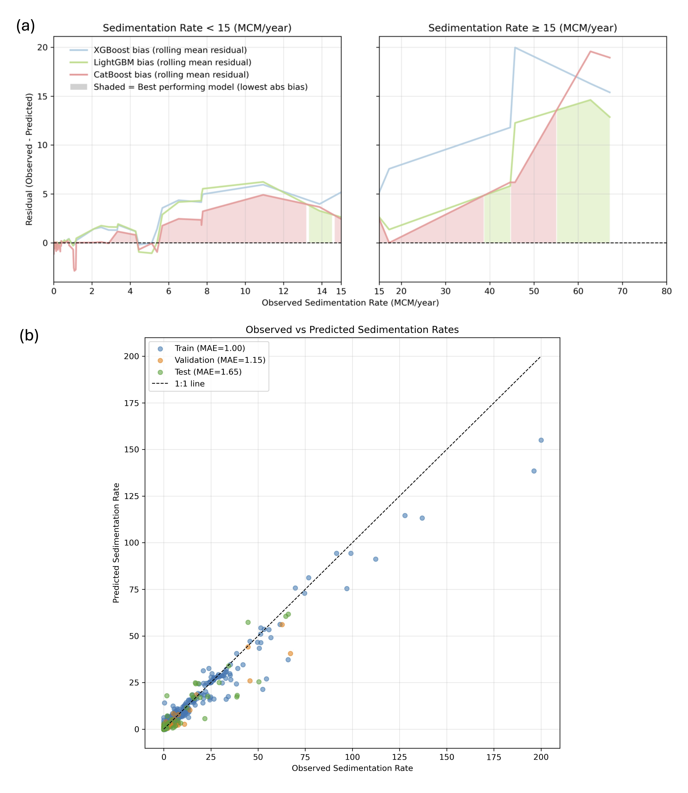

RECLAIM Ensemble
=================

RECLAIM integrates three gradient boosting models—XGBoost, LightGBM, and CatBoost—into a weighted ensemble to improve the accuracy and robustness of sedimentation rate (SR) predictions.

Loss Functions
--------------

- **XGBoost and LightGBM:** Tweedie loss function  
  (So and Valdez, 2024; Manna et al., 2025)  
  Suited for datasets with many small values and occasional large extremes, balancing continuous values and rare events such as reservoir sedimentation.

- **CatBoost:** Huber loss function (Huber, 1992)  
  Behaves like mean squared error for most values but switches to mean absolute error for outliers, reducing their influence while capturing the overall pattern.

Dynamic Ensemble Weighting
-------------------------

To leverage complementary strengths of the models, RECLAIM uses a **dynamic weighting scheme** rather than a simple average:

- **Below threshold (default SR = 15 MCM/year):**
  - CatBoost weight: increases from 30% → 55%. 
  - XGBoost weight: decreases from 45% → 25%. 
  - LightGBM weight: slightly increases from 25% → 30%. 

- **Above threshold:**
  - CatBoost weight: fixed at 60%. 
  - XGBoost weight: decreases from 15% → 5%. 
  - LightGBM weight: increases from 25% → 35%. 

Weights are smoothed using sigmoid functions to ensure gradual transitions. This scheme emphasizes the most reliable model in each regime while retaining contributions from all three algorithms.

**Figure:** (a) Residual patterns of individual models across validation data, and (b) comparison of RECLAIM predictions with observed SR values (training, validation, and test sets).

Performance
------------------

**Performance Metrics:** RMSE, MAE, and R² for RECLAIM across different datasets.  

+------------+---------------------------+----------------------------+---------------------------+
| Data Split | RMSE (MCM/year)           | MAE (MCM/year)             | R²                        |
+============+===========================+============================+===========================+
| Train      | 3.45                      | 1.0                        | 0.95                      |
+------------+---------------------------+----------------------------+---------------------------+
| Validation | 3.57                      | 1.15                       | 0.89                      |
+------------+---------------------------+----------------------------+---------------------------+
| Test       | 4.44                      | 1.65                       | 0.86                      |
+------------+---------------------------+----------------------------+---------------------------+

Notes
-----

RECLAIM slightly outperforms CatBoost, the strongest individual model, while integrating complementary information from XGBoost and LightGBM. The dynamic weighting approach offers more robust and generalizable SR predictions, particularly across extreme values.